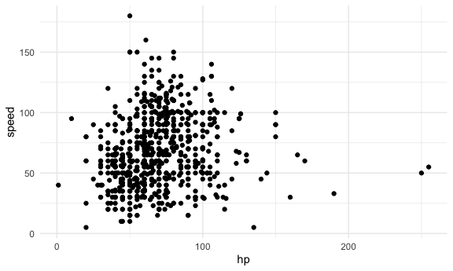

Statistical Learning
================

Load key packages.

``` r
library(tidyverse)
library(glmnet)
```

    ## Loading required package: Matrix

    ## 
    ## Attaching package: 'Matrix'

    ## The following objects are masked from 'package:tidyr':
    ## 
    ##     expand, pack, unpack

    ## Loaded glmnet 4.1-10

``` r
library(palmerpenguins)
```

    ## 
    ## Attaching package: 'palmerpenguins'

    ## The following objects are masked from 'package:datasets':
    ## 
    ##     penguins, penguins_raw

``` r
set.seed(11)
```

## Do LASSO

``` r
bwt_df = 
  read_csv("data/birthweight.csv") |> 
  janitor::clean_names() |>
  mutate(
    babysex = 
        case_match(babysex,
            1 ~ "male",
            2 ~ "female"
        ),
    babysex = fct_infreq(babysex),
    frace = 
        case_match(frace,
            1 ~ "white",
            2 ~ "black", 
            3 ~ "asian", 
            4 ~ "puerto rican", 
            8 ~ "other"),
    frace = fct_infreq(frace),
    mrace = 
        case_match(mrace,
            1 ~ "white",
            2 ~ "black", 
            3 ~ "asian", 
            4 ~ "puerto rican",
            8 ~ "other"),
    mrace = fct_infreq(mrace),
    malform = as.logical(malform)) |> 
  sample_n(100)
```

    ## Rows: 4342 Columns: 20
    ## ── Column specification ────────────────────────────────────────────────────────
    ## Delimiter: ","
    ## dbl (20): babysex, bhead, blength, bwt, delwt, fincome, frace, gaweeks, malf...
    ## 
    ## ℹ Use `spec()` to retrieve the full column specification for this data.
    ## ℹ Specify the column types or set `show_col_types = FALSE` to quiet this message.

Need to do some data processing.

``` r
x = model.matrix(bwt ~ ., bwt_df)[, -1]
y = bwt_df |> pull(bwt)
```

Define some lambdas and fit Lasso for each.

``` r
lambda = 10^(seq(-2, 2.75, 0.1))

lasso_fit = 
    glmnet(x = x, y = y, lambda = lambda)

lasso_cv = 
    cv.glmnet(x = x, y = y, lambda = lambda)

lambda_opt = lasso_cv[["lambda.min"]]
```

There’s a lot of stuff in these.

Here’s plot 1.

``` r
lasso_fit |> 
    broom::tidy() |> 
    select(term, lambda, estimate) |> 
    complete(term, lambda, fill = list(estimate = 0)) |> 
    filter(term != "(Intercept)") |> 
    ggplot(aes(x = log(lambda, 10), y = estimate, group = term, color = term)) + 
    geom_line() + 
    geom_vline(xintercept = log(lambda_opt, 10))
```


Next is plot 2.

``` r
lasso_cv |> 
    broom::tidy() |> 
    ggplot(aes(x = log(lambda, 10), y = estimate)) +
    geom_point()
```


Do lasso with the right lambda.

``` r
lasso_fit = 
    glmnet(x = x, y = y, lambda = lambda_opt)
```

## Clustering

Look at pokemon!

``` r
pokemon_df = 
    read_csv("data/pokemon.csv") |> 
    janitor::clean_names() |> 
    select(hp, speed)
```

    ## Rows: 800 Columns: 13
    ## ── Column specification ────────────────────────────────────────────────────────
    ## Delimiter: ","
    ## chr (3): Name, Type 1, Type 2
    ## dbl (9): #, Total, HP, Attack, Defense, Sp. Atk, Sp. Def, Speed, Generation
    ## lgl (1): Legendary
    ## 
    ## ℹ Use `spec()` to retrieve the full column specification for this data.
    ## ℹ Specify the column types or set `show_col_types = FALSE` to quiet this message.

``` r
pokemon_df |> 
    ggplot(aes(x = hp, y = speed)) + 
    geom_point()
```



Fit kmeans clustering to this dataset.

``` r
kmeans_fit = 
    kmeans(x = pokemon_df, centers = 3)
```

Use `broom` to get nice results.

``` r
pokemon_df = 
    broom::augment(kmeans_fit, pokemon_df)
```

Look at results!

``` r
pokemon_df |> 
    ggplot(aes(x = hp, y = speed, color = .cluster)) + 
    geom_point()
```


